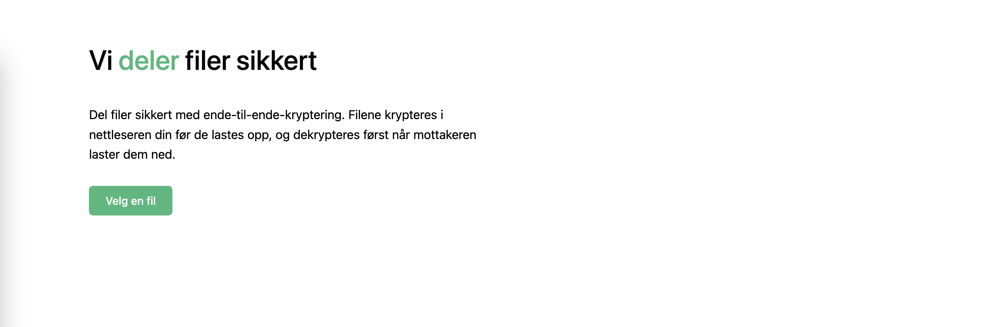
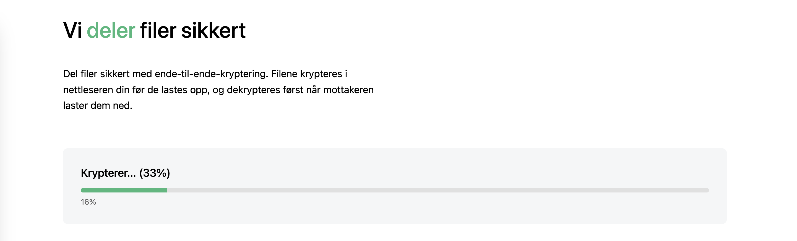
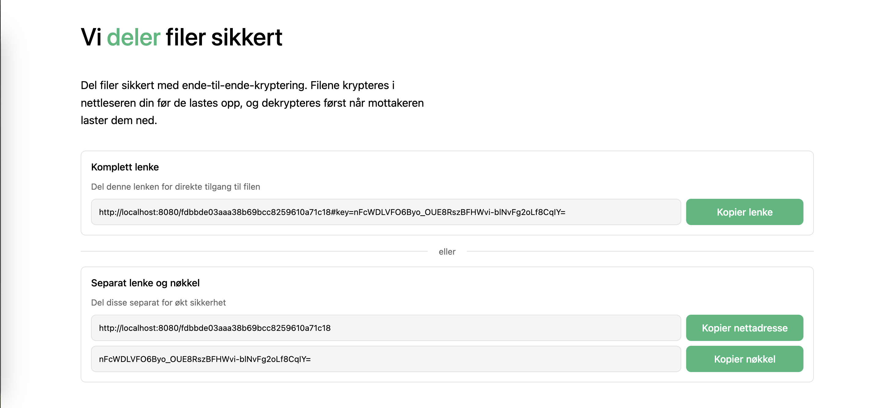
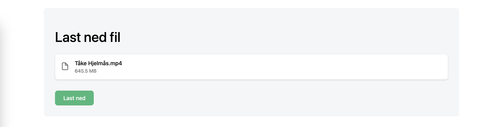
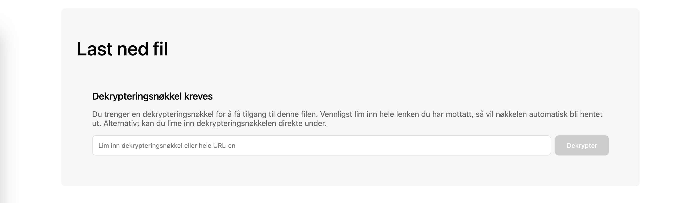

# Paste (pɛjstə)

Zero-knowledge file sharing server with client-side encryption in Golang. The server never sees unencrypted file contents or metadata.

Paste is created to be an easy and secure way of sharing a file with someone for a short period of time.



## 🔒 Security Design

- AES-GCM encryption/decryption using WebAssembly in the browser
  - Supports 128-bit, 192-bit, and 256-bit keys (defaults to 128-bit)
  - Uses cryptographically secure random number generation
  - Implements authenticated encryption (AEAD) with integrity checks
  - Unique 96-bit IV (nonce) for each file and chunk
- Streaming encryption for large files
  - Processes files in 1MB chunks to avoid memory issues
  - Ensures unique nonces across chunks using counters
  - Maintains data integrity across chunk boundaries
- Zero server-side knowledge
  - Server stores only encrypted blobs
  - No unencrypted metadata or filenames stored server-side
  - Encryption keys never leave the client
  - Each file gets a unique identifier and encryption key

## 📸 Screenshots

### Upload

*Client-side WASM encryption before upload*

### Share

*Share encrypted file ID and key*

### Download

*Client-side decryption with provided key*

### Decryption

*Client-side WASM decryption with optional private key input*

## 🚀 Development

### Using Dev Container (Recommended)

1. Install [VS Code](https://code.visualstudio.com/) and [Dev Containers extension](https://marketplace.visualstudio.com/items?itemName=ms-vscode-remote.remote-containers)

2. Clone and open:
```bash
git clone https://github.com/jonasbg/paste
code paste
```

3. When prompted, click "Reopen in Container"

The dev container provides:
- Go 1.23 with debugging
- Node.js for SvelteKit
- SQLite for access logging only
- Auto-built WASM encryption

### Manual Setup

```bash
# Build WASM
mkdir -p web/static
cp "$(go env GOROOT)/misc/wasm/wasm_exec.js" web/static/
GOOS=js GOARCH=wasm go build -o web/static/encryption.wasm ./wasm/wasm.go

# Build and run backend
cd api && go build -o pastly
./pastly

# Run frontend
cd ../web
npm install
npm run dev
```

## 🔌 API Endpoints

```bash
GET    /api/download/:id      # Download encrypted blob
GET    /api/metadata/:id      # Get encrypted metadata
GET    /api/ws/upload         # WebSocket upload for large files
GET    /api/metrics/*         # Server stats (no file info)
```

## 🌍 Environment Variables

The application can be configured using the following environment variables:

| Variable | Description | Default | Example |
|----------|-------------|---------|---------|
| `UPLOAD_DIR` | Directory where uploaded files are stored | `./uploads` | `/data/uploads` |
| `DATABASE_DIR` | Directory where the SQLite database is stored | `./uploads` | `/data/db` |
| `WEB_DIR` | Directory containing static web files | `../web` | `/app/web` |
| `FILES_RETENTION_DAYS` | Number of days to keep uploaded files before deletion | `7` | `14` |
| `LOGS_RETENTION_DAYS` | Number of days to keep logs (negative for infinite) | `180` | `-1` |
| `MAX_FILE_SIZE`  | Maximum allowed size for uploaded files.       | `1GB`          | A number followed by `KB`, `MB`, `GB`, or `TB` (case-insensitive).        | `2MB`, `500KB`, `10GB` |
| `ID_SIZE`        | Size of the generated IDs.                       | `64` (bit)       | One of: `64`, `128`, `192`, `256` (case-insensitive).              | `128`           |
| `KEY_SIZE`       | Size of the encryption keys.                     | `128`       | One of: `128`, `192`, `256` (case-insensitive).              | `256`           |

## 🛡️ Security Implementation Details

This section provides a deeper dive into how Paste achieves its security goals.

### Key Generation

- **Client-Side Key Generation:** Encryption keys are *never* sent to the server. They are generated exclusively within the user's browser using WebAssembly.
- **Cryptographically Secure Randomness:** The `generateKey` function (implemented in `wasm.go` and called from JavaScript) leverages Go's `crypto/rand` package (`rand.Read`). This provides a cryptographically secure source of random numbers, crucial for strong key generation.
- **Configurable Key Size:** The application supports configurable key sizes (128-bit, 192-bit, and 256-bit AES). The key size defaults to 256 bits.
- **AES-GCM:** The application uses the Advanced Encryption Standard in Galois/Counter Mode (AES-GCM).  This is a modern, authenticated encryption mode providing both confidentiality (encryption) and authenticity (integrity verification, protecting against tampering). The Go standard library's `crypto/aes` and `crypto/cipher` packages are used (`wasm.go`).

### File and Metadata Encryption

- **Streaming Encryption:** Large files are processed in chunks to avoid loading the entire file into memory. This is handled by the `encryptChunk` and `decryptChunk` functions in the WebAssembly module (`wasm.go`). The JavaScript code slices the file into chunks and sends them sequentially.
- **Unique IVs (Initialization Vectors/Nonces):** A unique 96-bit (12-byte) IV is generated for *each* file using `crypto/rand` (`wasm.go`, `createEncryptionStream` function). This IV is prepended to the encrypted data.  For chunked uploads, the `StreamingCipher` struct (`wasm.go`) manages the IV, incrementing a counter (`chunk`) for each chunk to guarantee uniqueness, preventing nonce-reuse attacks.
- **Metadata Encryption:** File metadata (filename, content type, size) is also encrypted using AES-GCM. The *same* file encryption key is used, but with a *different* IV. The `decryptMetadata` function (`wasm.go`) handles metadata decryption. Metadata is serialized to JSON before encryption and deserialized after. The length of the encrypted metadata, along with the IV, is prepended to the encrypted metadata.
- **Header and Metadata Validation:**  The `validateWasmEncryption` function (`files.go` - *server-side*) performs several checks *before* any decryption attempt:
    - **Header Size:** Verifies the header size.
    - **IV Validity:** Checks that the IV is not all zeros (a weak IV).
    - **Metadata Length:** Ensures the metadata length in the header matches the actual encrypted metadata length and is within reasonable bounds.
    - **Minimum Encrypted Data Size:** Checks for a minimum size, accounting for the GCM authentication tag.

### File ID and HMAC Token Generation (and Verification)

- **File ID:** The File ID is generated on the server side when a new upload begins. The server uses this ID to retrieve the encrypted blob.
- **HMAC Token:**  For download verification, an HMAC (Hash-based Message Authentication Code) token is generated *client-side* using the `generateHmacToken` function (`wasm.go`).
    - **Purpose:** This token acts as proof of possession of the encryption key.  It prevents unauthorized downloads even if the File ID is known. The server *never* sees the encryption key itself.
    - **Generation:** The token is derived from the *file encryption key* and the *File ID* using HMAC-SHA256.  The first 12 bytes of the HMAC signature are base64 URL-encoded to create the token.
    - **Client-Side Generation:** Note that the token generation happens within the WebAssembly module in the user's browser.
- **Verification:**
    - The client provides the File ID and the *HMAC token* (in the request headers) when requesting a download or metadata. The encryption key itself is *never* sent to the server.
    - The `fetchMetadata` function (`+page.svelte`, and likely `downloadAndDecryptFile`) sends both file id and HMAC token.
    - The server uses the file id to fetch the stored encrypted blob.
    - The client-computed HMAC token helps ensure that whoever is requesting to decrypt the file *actually possesses* the correct encryption key. Since only someone with the key can generate the correct token, successful token generation implies authorized access.

### Server-Side Handling

- **Zero-Knowledge Storage:** The server *only* stores encrypted data. It has *no* knowledge of file contents, filenames, or encryption keys.
- **Database Interactions:**  Some metadata *about* the files (e.g., upload timestamps, potentially encrypted metadata sizes) is stored in a database, but the database *never* contains decryption keys.
- **File Deletion:** Files are automatically deleted after a configured retention period (`FILES_RETENTION_DAYS` environment variable).

### Overall Security Posture

- **Defense in Depth:** The system uses multiple layers of security:
    - **Client-side Encryption:** The primary layer, ensuring the server never sees plaintext.
    - **Authenticated Encryption (AES-GCM):** Protects against both eavesdropping and tampering.
    - **Unique IVs:** Prevents nonce-reuse attacks.
    - **HMAC Token Verification:** Verifies possession of the encryption key before allowing downloads.
    - **Server-Side Validation:** Checks the integrity of encrypted data *before* any decryption attempt.
    - **Short Retention Period:** Minimizes the window of opportunity for attacks.
- **No Single Point of Failure:** Even if the server is compromised, the attacker cannot decrypt the files without the encryption keys. The keys are **only ever** present in the user's browser, and the server cannot derive them from the HMAC tokens.

## ❓ FAQ

### Why use WebAssembly for encryption?
While browsers provide the Web Crypto API, it requires loading the entire file into memory for encryption/decryption, which can freeze the browser for large files. WebAssembly allows us to process files in chunks, providing a smoother experience without memory issues.

### Why use WebSockets for file upload?
Many HTTP proxies and servers have file size limits when using traditional multipart form uploads. WebSockets allow us to chunk large files into 1MB blocks, bypassing these limitations while providing upload progress feedback.

### Does that means it violates ToS?
Probably. Most certain. While WebSocket chunking can technically bypass file size limits, this should only be implemented on your own infrastructure. Most cloud providers and CDNs like Cloudflare have file size limits (e.g. 100MB). You should read their Terms of Service.

### Is my data really secure?
Yes. All encryption happens in your browser using AES-GCM with 256-bit keys before upload. The server only sees encrypted data and never receives encryption keys or unencrypted metadata. Each file gets a unique identifier, encryption key, and IV (nonce), making it impossible to list or access files without having both the ID and key.

### What encryption algorithm is used?
We use AES-GCM (Galois/Counter Mode) which provides both confidentiality and authentication. For streaming large files, we implement chunked encryption with unique nonces per chunk. Keys are 256-bit by default and generated using cryptographically secure random number generation in the browser.

### How long are files stored?
Files are deleted after 7 days after uploading.

### Are there file size limits?
Files are processed in 1MB chunks, allowing for efficient handling of large files. While there's no hard size limit, browser memory constraints and network conditions may affect performance for extremely large files.

### Can I delete files after upload?
Yes, by downloading the blob.

## 📝 License

MIT License - see [LICENSE](LICENSE)